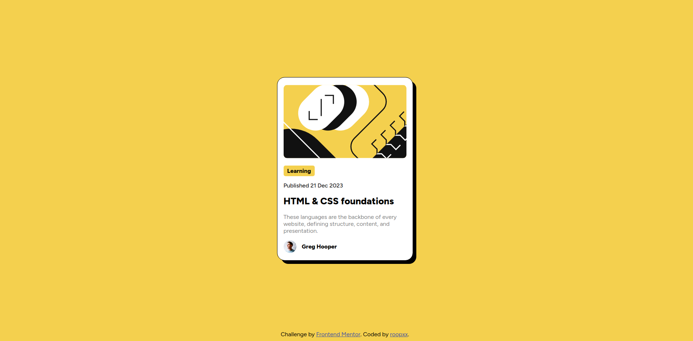
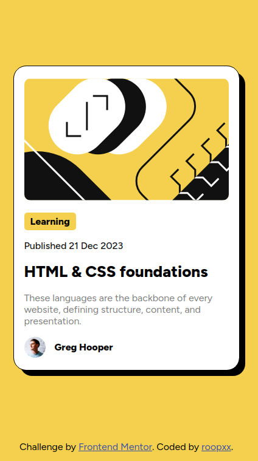

# Frontend Mentor - Blog preview card solution

This is a solution to the [Blog preview card challenge on Frontend Mentor](https://www.frontendmentor.io/challenges/blog-preview-card-ckPaj01IcS). Frontend Mentor challenges help you improve your coding skills by building realistic projects.

## Table of contents

- [The challenge](#the-challenge)
- [Screenshot](#screenshot)
- [Links](#links)
- [My process](#my-process)
  - [Built with](#built-with)
  - [What I learned](#what-i-learned)
- [Author](#author)

## Overview

### The challenge

Users should be able to:

- See hover and focus states for all interactive elements on the page

### Screenshot

### Links

- Live Site URL: [Blog preview card](https://blog-preview-card-main-blush-three.vercel.app/)

## My process

### Built with

- Semantic HTML5 markup
- CSS custom properties
- Flexbox
- CSS Grid
- Mobile-first workflow

### What I learned

It was another basic challenge but still doing the challenge makes me feel good and proud. Hurray!!!

## Author

- GitHub - [@roopxx](https://github.com/roopxx)
- Frontend Mentor - [@roopxx](https://www.frontendmentor.io/profile/roopxx)
- Twitter - [@roopxx](https://www.twitter.com/roopxx)
