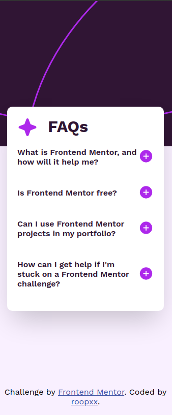

# Frontend Mentor - FAQ accordion solution

This is a solution to the [FAQ accordion challenge on Frontend Mentor](https://www.frontendmentor.io/challenges/faq-accordion-wyfFdeBwBz). Frontend Mentor challenges help you improve your coding skills by building realistic projects.

## Table of contents

- [Overview](#overview)
  - [The challenge](#the-challenge)
  - [Screenshot](#screenshot)
  - [Links](#links)
- [My process](#my-process)
  - [Built with](#built-with)
  - [What I learned](#what-i-learned)
- [Author](#author)

## Overview

### The challenge

Users should be able to:

- Hide/Show the answer to a question when the question is clicked
- Navigate the questions and hide/show answers using keyboard navigation alone
- View the optimal layout for the interface depending on their device's screen size
- See hover and focus states for all interactive elements on the page

### Screenshot

### Links

- Live Site URL: [FAQ accordion](https://faq-accordion-main-d8jmy4t3a-roopxxs-projects.vercel.app/)

## My process

### Built with

- Semantic HTML5 markup
- CSS custom properties
- Flexbox
- Mobile-first workflow

### What I learned

Completing this challenge introduced me to JavaScript for the first time in FEM, deepening my understanding of web development. I learned how to use JavaScript (I know JS but using it after doing few projects in REACT was fun :smiley: ) to create interactive features like the hide/show functionality in the FAQ accordion. Additionally, I honed my CSS skills to fine-tune the layout and design.

Also JavaScript is amazing language and it makes any challenge FUN :smile: , I love JS.

## Author

- GitHub - [@roopxx](https://github.com/roopxx)
- Frontend Mentor - [@roopxx](https://www.frontendmentor.io/profile/roopxx)
- Twitter - [@roopxx](https://www.twitter.com/roopxx)
