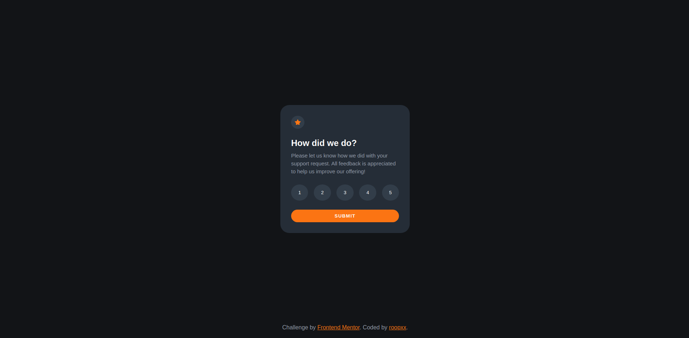
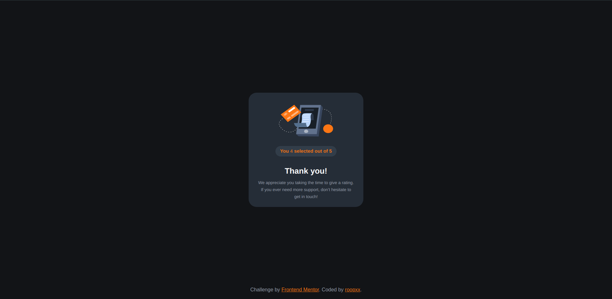
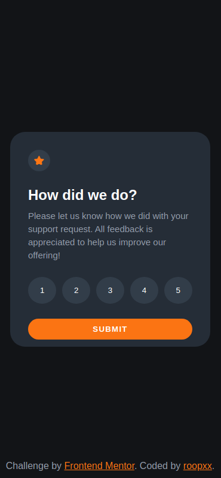
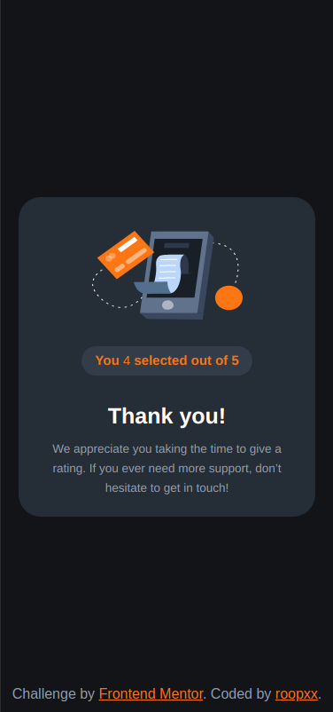

# Frontend Mentor - Interactive rating component solution

This is a solution to the [Interactive rating component challenge on Frontend Mentor](https://www.frontendmentor.io/challenges/interactive-rating-component-koxpeBUmI). Frontend Mentor challenges help you improve your coding skills by building realistic projects.

## Table of contents

- [Overview](#overview)
  - [The challenge](#the-challenge)
  - [Screenshot](#screenshot)
  - [Links](#links)
- [My process](#my-process)
  - [Built with](#built-with)
  - [What I learned](#what-i-learned)
- [Author](#author)

## Overview

### The challenge

Users should be able to:

- View the optimal layout for the app depending on their device's screen size
- See hover states for all interactive elements on the page
- Select and submit a number rating
- See the "Thank you" card state after submitting a rating

### Screenshot

#### Desktop

### Mobile

### Links

- Live Site URL: [Interactive rating component solution](https://interactive-rating-component-main-topaz-chi.vercel.app/)

## My process

### Built with

- Semantic HTML5 markup
- CSS custom properties
- Flexbox
- Mobile-first workflow

### What I learned

This assignment was good to learn javascript. I learned how to use `forEach` method to loop through the array of `button` elements and add event listeners to each rating button. I also learned how to use `classList` to add and remove classes to the elements. I also designed the layout using flexbox and implemented the mobile-first workflow.

## Author

- GitHub - [@roopxx](https://github.com/roopxx)
- Frontend Mentor - [@roopxx](https://www.frontendmentor.io/profile/roopxx)
- Twitter - [@roopxx](https://www.twitter.com/roopxx)
