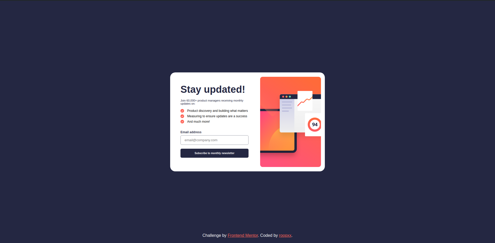
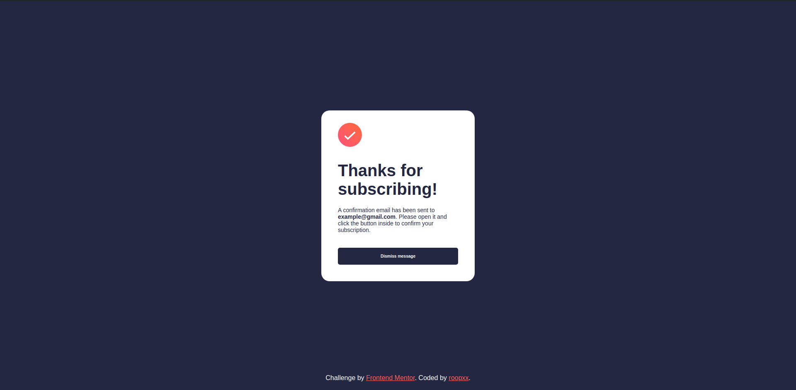
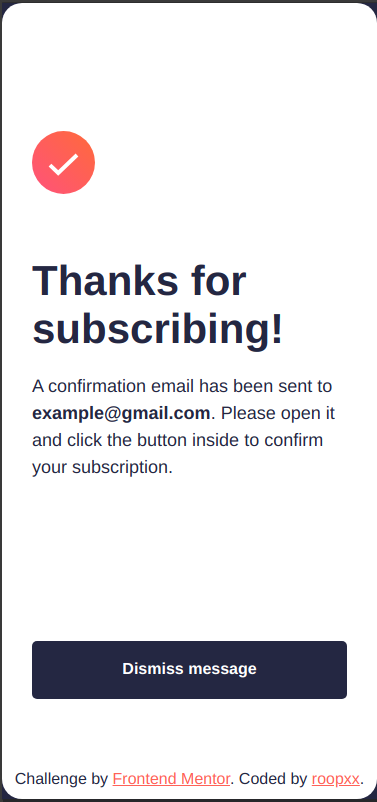

# Frontend Mentor - Newsletter sign-up form with success message solution

This is a solution to the [Newsletter sign-up form with success message challenge on Frontend Mentor](https://www.frontendmentor.io/challenges/newsletter-signup-form-with-success-message-3FC1AZbNrv). Frontend Mentor challenges help you improve your coding skills by building realistic projects.

## Table of contents

- [Overview](#overview)
  - [The challenge](#the-challenge)
  - [Screenshot](#screenshot)
  - [Links](#links)
- [My process](#my-process)
  - [Built with](#built-with)
  - [What I learned](#what-i-learned)
  - [Continued development](#continued-development)
  - [Useful resources](#useful-resources)
- [Author](#author)
- [Acknowledgments](#acknowledgments)

## Overview

### The challenge

Users should be able to:

- Add their email and submit the form
- See a success message with their email after successfully submitting the form
- See form validation messages if:
  - The field is left empty
  - The email address is not formatted correctly
- View the optimal layout for the interface depending on their device's screen size
- See hover and focus states for all interactive elements on the page

### Screenshot

#### Desktop

### Mobile

### Links

- Live Site URL: [Newsletter sign-up form with success message solution](https://your-live-site-url.com)

## My process

### Built with

- Semantic HTML5 markup
- CSS custom properties
- Flexbox
- Mobile-first workflow

### What I Learned

1. **HTML**: Mastered structuring and validating a sign-up form.
2. **CSS**: Utilized custom properties for consistent styling, practiced Flexbox for layout, and implemented responsive designs with media queries.
3. **JavaScript**: Added interactivity to the form, including form submission success message and email validation.
4. **DOM Manipulation**: Manipulated visibility of elements based on user interaction.
5. **Mobile-First Design**: Implemented a design that is responsive and user-friendly on all screen sizes.

## Author

- GitHub - [@roopxx](https://github.com/roopxx)
- Frontend Mentor - [@roopxx](https://www.frontendmentor.io/profile/roopxx)
- Twitter - [@roopxx](https://www.twitter.com/roopxx)
