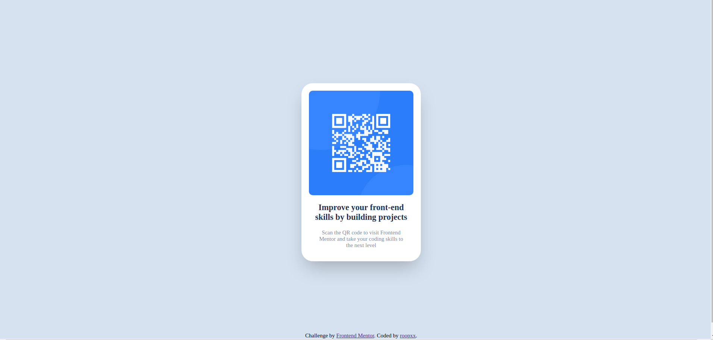
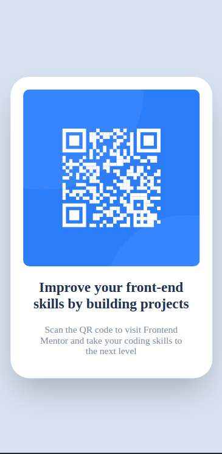

# Frontend Mentor - QR Code Component Solution

This is my solution to the [QR code component challenge on Frontend Mentor](https://www.frontendmentor.io/challenges/qr-code-component-iux_sIO_H). Frontend Mentor challenges are designed to help you improve your coding skills by building realistic projects.

## Table of Contents

- [Screenshot](#screenshot)
- [Links](#links)
- [My Process](#my-process)
  - [Built With](#built-with)
  - [What I Learned](#what-i-learned)
- [Author](#author)

### Screenshot

### Links

- Live Site URL: [QR Code Component](https://qr-code-component-main-seven-coral.vercel.app/)

## My Process

### Built With

- Semantic HTML5 markup
- CSS custom properties
- Flexbox
- Mobile-first workflow

### What I Learned

I've always been eager to solidify my CSS knowledge, and I've been learning full-stack web development from [The Odin Project](https://www.theodinproject.com/), which is the absolute best resource with a great community I've ever found. As an Odinate, the key lesson taught there is that to master anything, practice is essential. So, I searched for a platform where I could practice my CSS and design skills, and that's where [Frontend Mentor](https://www.frontendmentor.io/) comes in. This was my first challenge, and it was relatively easy as it involved basic CSS. I'm looking forward to completing more challenges.

Additionally, I will submit all my challenges in this [repository](https://github.com/roopxx/frontend-mentor-challenges) and will strive to keep it updated as I continue learning by completing more challenges.

## Author

- GitHub - [@roopxx](https://github.com/roopxx)
- Frontend Mentor - [@roopxx](https://www.frontendmentor.io/profile/roopxx)
- Twitter - [@roopxx](https://www.twitter.com/roopxx)
