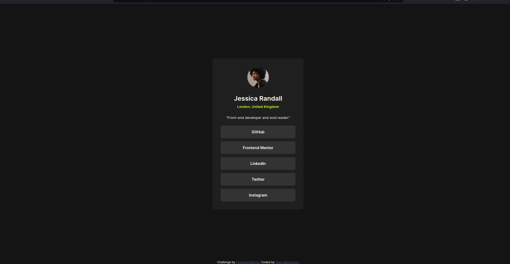
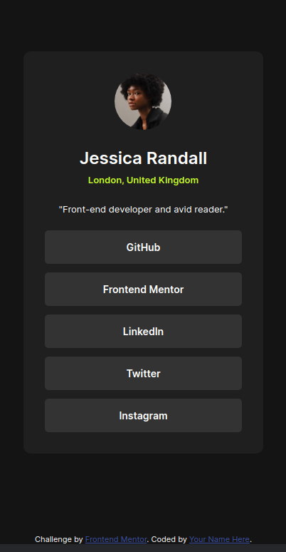

# Frontend Mentor - Social links profile solution

This is a solution to the [Social links profile challenge on Frontend Mentor](https://www.frontendmentor.io/challenges/social-links-profile-UG32l9m6dQ). Frontend Mentor challenges help you improve your coding skills by building realistic projects.

## Table of Contents

- [Screenshot](#screenshot)
- [Links](#links)
- [My Process](#my-process)
  - [Built With](#built-with)
  - [What I Learned](#what-i-learned)
- [Author](#author)

### Screenshot

### Links

- Live Site URL: [Social links profile](https://social-links-profile-main-sooty.vercel.app/)

## My Process

### Built With

- Semantic HTML5 markup
- CSS custom properties
- Flexbox
- Mobile-first workflow

### What I Learned

This challenge was my third Frontend Mentor challenge, and it has significantly contributed to enhancing my CSS skills. One of the key learnings from this project was the importance of utilizing the all selector `*` to adjust margins and padding according to the design specifications (I forgot about resetting the defaults in previous challenges). This experience has helped me identify and address blind spots in my CSS knowledge, making my skills more robust.

## Author

- GitHub - [@roopxx](https://github.com/roopxx)
- Frontend Mentor - [@roopxx](https://www.frontendmentor.io/profile/roopxx)
- Twitter - [@roopxx](https://www.twitter.com/roopxx)
